<h1 align="center">GoAttack</h1>

<p align="center">
  
</p>

<p align="center">
  <strong>Go 开发的高级网络安全扫描分析平台</strong>
</p>

<p align="center">
  
  
  
  
</p>

GoAttack 是一款运用Go语言作为后端和Vue 3作为前端开发的现代化网络安全扫描分析平台。它被设计用于对标商业级漏洞扫描器，并提供一系列包括主机探测、端点梳理、资产测绘、漏扫POC验证和自动报告等多位一体的安全分析能力。旨在为安全工程师、红蓝渗透测试人员及安全运维管理团队提供一个精练、高效、可扩展且界面友好的集成式作战平台。

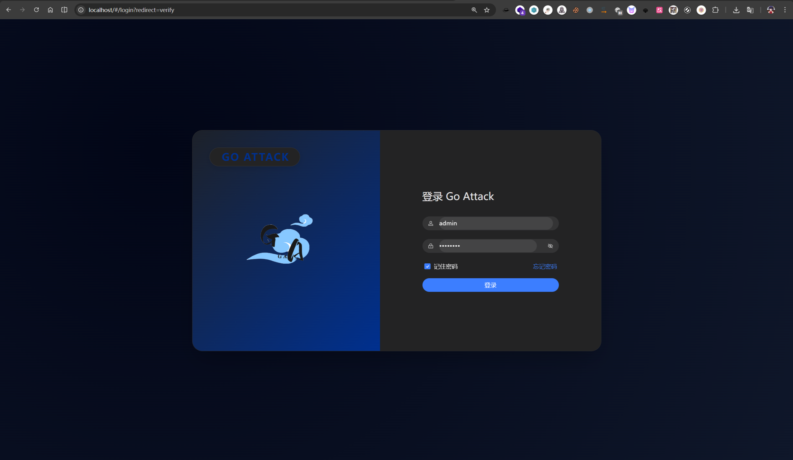

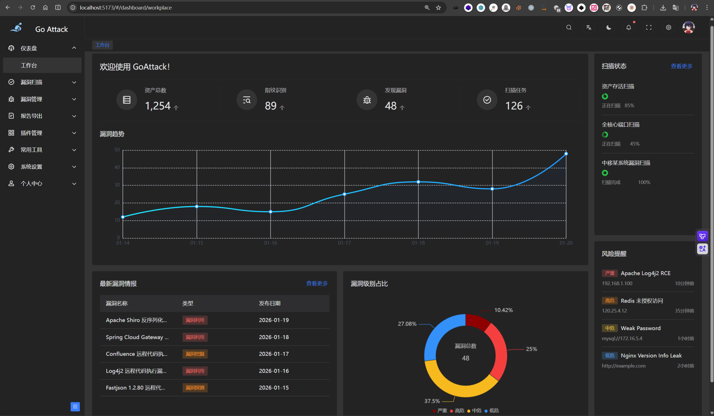

---

## 🚀 核心功能与特性

- **多维度资源发现与测绘**
  - **主机探测 (Alive Scan)**：利用 ICMP 快速扫描目标存活状态。
  - **端口扫描 (Port Scan)**：
    - 支持 TCP TOP1000 以及高并发的综合性端口扫描。
    - 支持 UDP TOP100 常规协议探测与解析。
  - **服务指纹识别**：结合自研引擎及 `nmap-service-probes`，精细识别并呈现对应运行的服务名称（Service）、产品（Product）和版本号（Version）。
  - **Web 技术栈识别**：内置深度重写的高能 Web 探针及 wappalyzer 引擎机制，精准识别 HTTP/HTTPS 协议下的建站程序、框架乃至路由重定向链。
  - **目录与子域名爆破**：兼容及内联搭载 `gobuster` 插件化组件进行高度配置化的目录枚举，扫描结果无缝链接至资产指纹模块展示。

*任务下发与资产测绘界面*
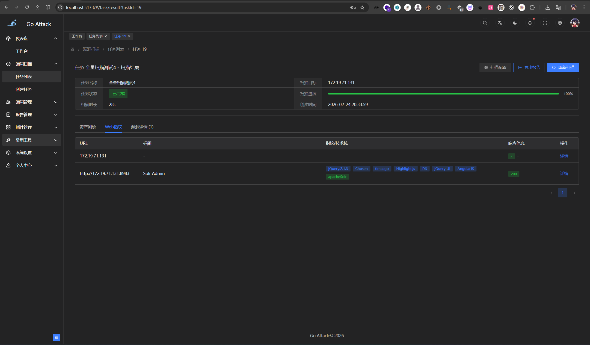


*资产搜索引擎集成集成*
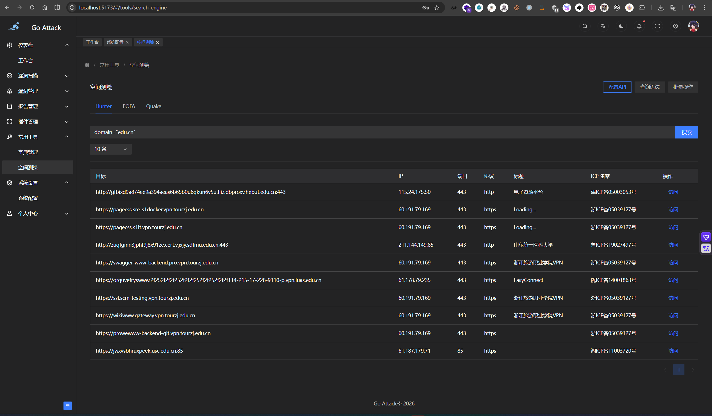


- **深度安全检查与审计**
  - **POC漏洞验证引擎**：强力集成 Nuclei 模板体系，自动执行精准匹配的 CVE/CNVD 级漏洞验证及提取证明。
  - **弱口令暴破攻击 (Brute-Force)**：自带高性能多协议服务口令探测模块，依托 Fscan 的扩展生态完成 SSH, MySQL, PostgreSQL, MSSQL, Redis, FTP, Mongo, RDP, SMB, Oracle, Telnet, VNC, WinRM, ElasticSearch, Jenkins, Tomcat, Weblogic, JBoss, ActiveMQ, RabbitMQ, LDAP 等 20 多项常见核心企业基础服务的密码安全审查。并由资产服务版本指纹智能触发关联。
  - **POC 批量导入**：默认支持nuclei-templates模板批量导入，对目标进行漏洞验证。

*漏洞资产列表展示*
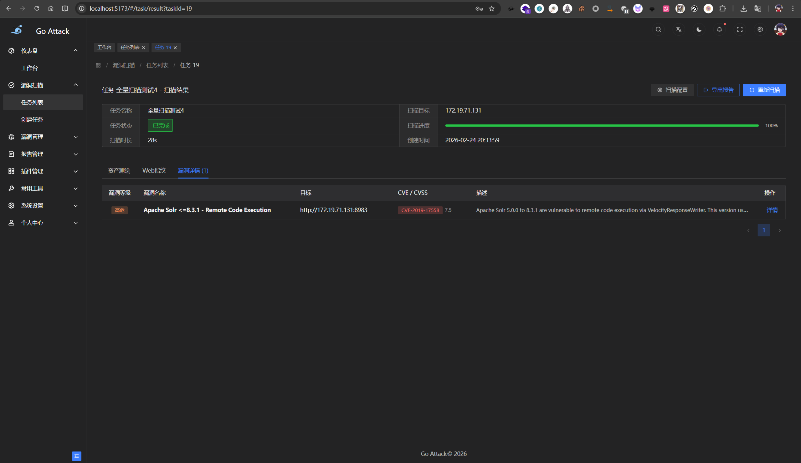

*POC 批量导入*
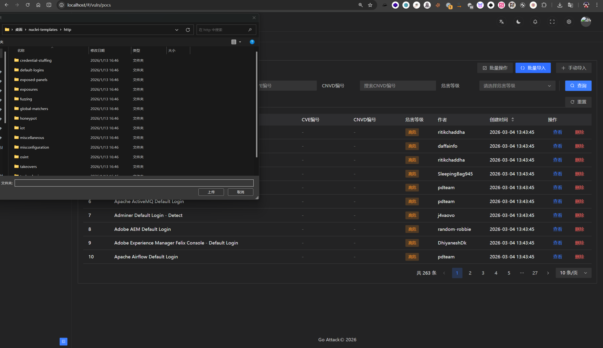


*POC 漏洞验证详情*
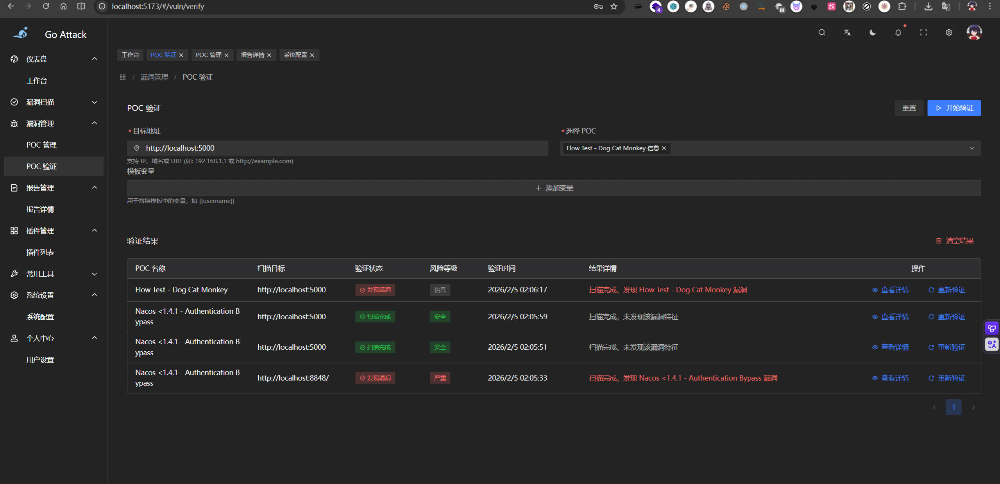


- **多样化协同与自定义扫描编排**
  - **三大主力扫描模式**：
    - 全量扫描：全方位深度扫描（主机 + TCP/UDP + 弱口令 + 目录枚举 + Web指纹 + POC漏洞验证）。
    - 快速扫描：精简实用流（主机 + TCP + Web指纹 + POC + 弱口令核心流）。
    - 自定义扫描：完全独立的子任务节点按需自勾选编排。
  - **高级选项护航**：包含定时任务扫描执行功能与 IP / 域名资产及危险端口双向黑名单。
  
- **安全数据中枢与展示流**
  - **现代管理仪表盘**：全盘监控安全数据变化、系统态势及漏洞严重度占比趋势。
  - **系统预警与消息**：内置红点及动态数值提醒系统，针对高危或致命级新漏洞资产进行实时下发提示。
  - **报告中心模块**：一键归档与输出支持优质版式排列的 PDF 和 HTML 业务审计安全报告，适应甲乙方多重合规交付。

*报告中心与任务归档*
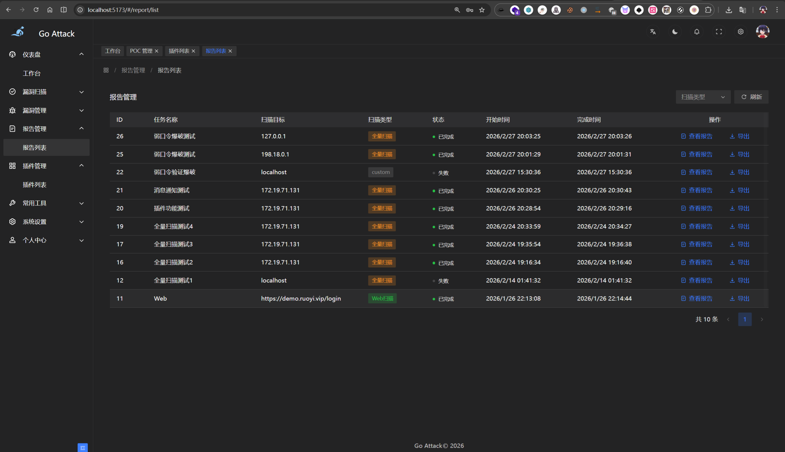

*精美的 HTML/PDF 漏洞报告详情*
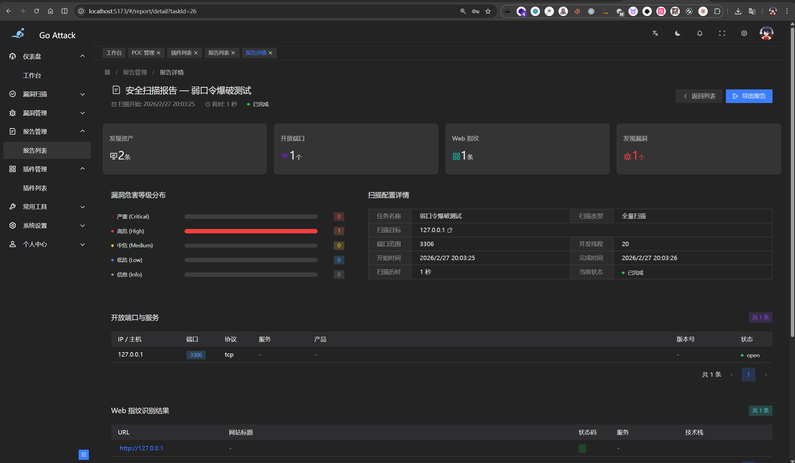

  - **动态组件功能池**
    - [x] 字典管理：对 password, directory, domain 类别字典的支持、统计与分类。
    - [x] 插件化工具池集成支持。

*Nuclei POC 模板管理*
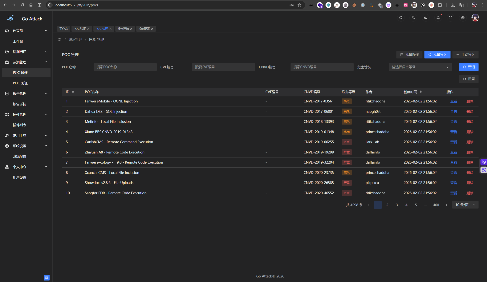

*插件化工具集扩展管理*
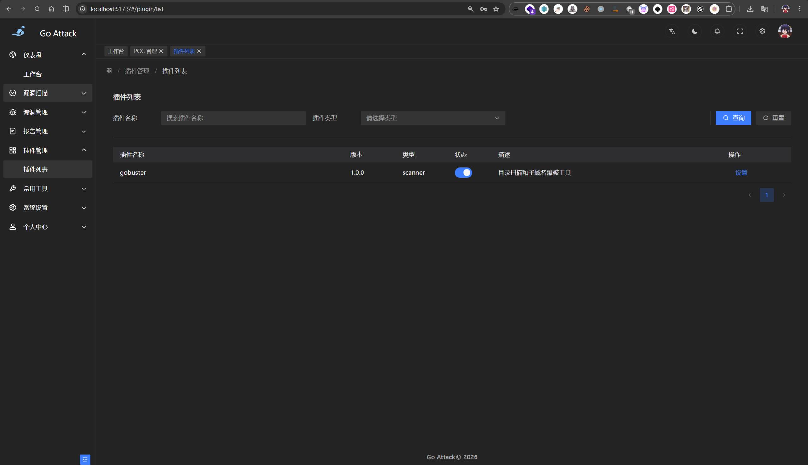


---


## 🛠 技术架构栈

* **后端服务**: Go (Gin, Go-Redis, Go-MySQL-Driver, Chromedp等)
* **前端展示**: Vue3 + TypeScript + Arco Design + Echarts
* **中间件及存储层**:
  * 关系数据库：MySQL 8.0+
  * 会话/缓存及消息协同：Redis (用于服务内进度同步等)
* **自动化与部署生态**: Docker, Docker-compose 级编排一键起建应用。

---

## 📦 部署与运行

### 使用 Docker 快速部署 (推荐)

使用项目提供的 `docker-compose.yml` 能够将 GoAttack 的运行环境包含 MySQL、Redis、以及 GoAttack 后端接口 API 在内进行一键容器化自动拉起部署。

1. **环境准备**
   请确保您所部署的主机上已安装好 `Docker` 及 `Docker Compose` 环境。
   
2. **构建与启动服务**
   使用控制台进入 `GoAttack-Docker` (`docker-compose.yml` 所在的目录)：
```bash
cd GoAttack-Docker
docker-compose up -d --build
```

   这会自动拉取与建立 `mysql` 及 `redis`，并自动构建运行 GoAttack 环境并对外暴露 API 的 3000 和 前端映射的端口。

### 手册本地部署

#### 1. 初始化数据库
确保本地或远程 MySQL (≥ 8.0) 数据库服务正在运行，并根据需要在 `GoAttack-Api/common/config/` (或相应环境配置) 中配置好数据库连接账号与密码。

GoAttack 启动时将会**自动检测并创建 `goattack` 数据库** (若不存在)，随后自动读取并执行 `GoAttack-Api/common/sql/init.sql` ，完成各关键表结构（如 `plugins`, `dashboard` 等视图）与基础数据的免操作初始化构建。

#### 2. 后端 API 编译启动 (GoAttack-Api)
依赖并安装需要使用的 Go 1.20 或以上版本。由于扫描需要执行端口扫描以及集成嗅探等权限需求，建议以管理员 ( Administrator / Root ) 身份开启。
```bash
cd GoAttack-Api/
go mod tidy
go build -o go-attack .
./go-attack
```
> *(或者直接使用快速部署进行热调测试：`go run main.go`)*

#### 3. 前端编译启动 (GoAttack-Admin)
```bash
cd GoAttack-Admin/
npm install
npm run dev
```

访问控制台给出的地址即可访问 GoAttack 面板。

**系统默认登录凭证：**
- **默认账号:** `admin`
- **默认密码:** `Qaz@123#`


---

## ⚠️ 免责声明 (Disclaimer)

*本工具仅用于防御性安全研究、合规的内部安全自查与具备授权的红蓝对抗演练。使用该程序对任何未授权系统进行探测、攻击或数据窃取皆属非法行为，若由此工具的任何被违规滥用情况引起的操作后果和连带法律责任，工具的开发者/作者概不负责。在使用且编译本工具前，默认被视为您已了解并接受所有相关法律。一切行为准则请遵守中华人民共和国网络安全法。*
